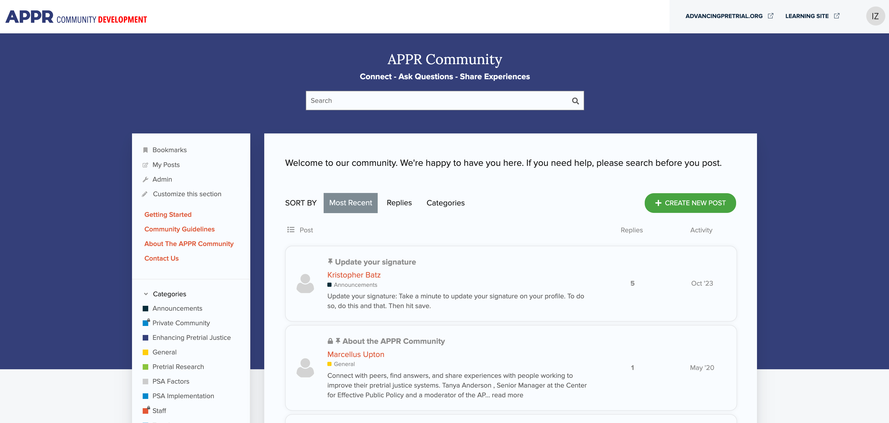

<!-- Describe this theme/component in one or two sentences -->

This is a custom theme for CEPP community platform.
Forked from https://github.com/discourse/discourse-air

<!-- Add screenshots (if applicable) -->

**Landing Page**

## Installation

1. Go to Admin -> Customize -> Themes
2. Click Install
3. Select From a git repository
4. Enter https://github.com/ExtensionEngine/cepp-discourse-air
5. Click Install

## Configuration

The following is a list of items that need to be configured in the Admin section for the theme to run properly:

### Admin -> Settings

- Branding -> `favicon` - Upload favicon if it does not exist
- Login -> check `login required` if not checked
- Navigation -> `default navigation menu categories` - add all categories

### Admin -> Customize

- Go to Text tab, search for `js.search.title` and set its value to 'Search'
- Themes -> Components -> Custom Header Links
  - Setup theme settings
  Custom header links
    - AdvancingPretrial.org, AdvancingPretrial.org, https://advancingpretrial.org/, vdm, self, keep, en
    - Learning Site, Learning Site, http://learn.advancingpretrial.org/, vdm, self, keep, en
  - Set `links position` to `right`
- Themes -> Components -> discourse-search-banner
  - show on - `all`
  - plugin outlet - `below-site-header`
  - search_banner.headline - `<a href="/">APPR Community</a>`
  - search_banner.subhead - `Connect - Ask Questions - Share Experiences`
- Themes -> CEPP Air Theme -> Theme Settings
  - Configure `appr_profile_app_link` and `welcome_message`

### Install and configure Discourse New Topic button theme component

1. Go to Admin -> Customize -> Themes -> Components
2. Click Install
3. Select From a git repository
4. Enter https://github.com/discourse/discourse-new-topic-button-theme-component
5. Click Install
6. Include component on current theme
7. Change _New topic button text_ and _New topic button title_ to `Create New Post`
8. Uncheck Hide default button

### Install and configure Discourse Topic List Author component

1. Go to Admin -> Customize -> Themes -> Components
2. Click Install
3. Select From a git repository
4. Enter https://github.com/ExtensionEngine/cepp-topic-list-author
5. Click Install
6. Include component on current theme
7. Uncheck all checkboxes under Theme Settings

## Helpful links

- [How to install a theme or theme component](https://meta.discourse.org/t/how-do-i-install-a-theme-or-theme-component/63682)
- [Beginner’s guide to using Discourse Themes](https://meta.discourse.org/t/beginners-guide-to-using-discourse-themes/91966)
